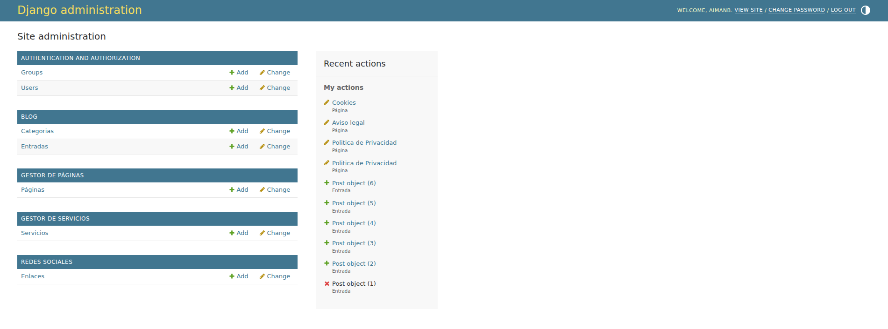
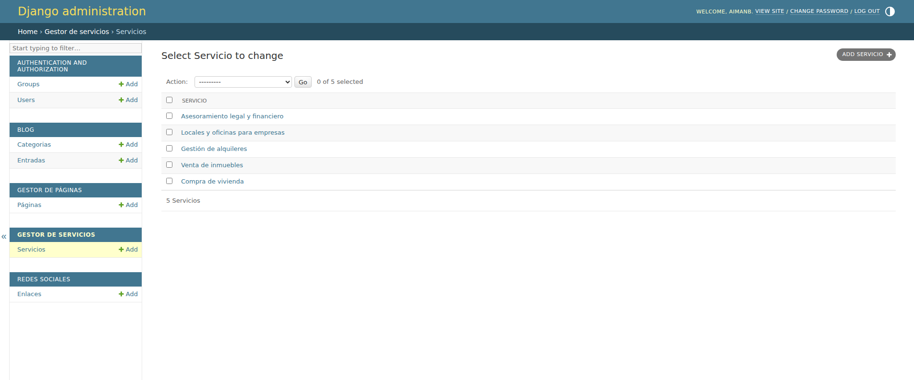
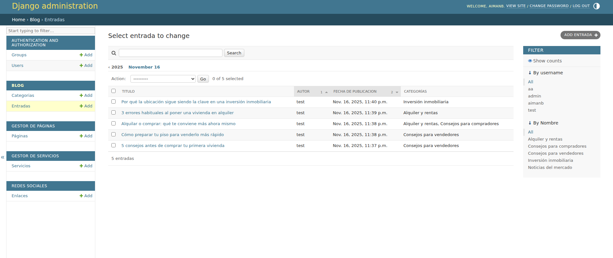
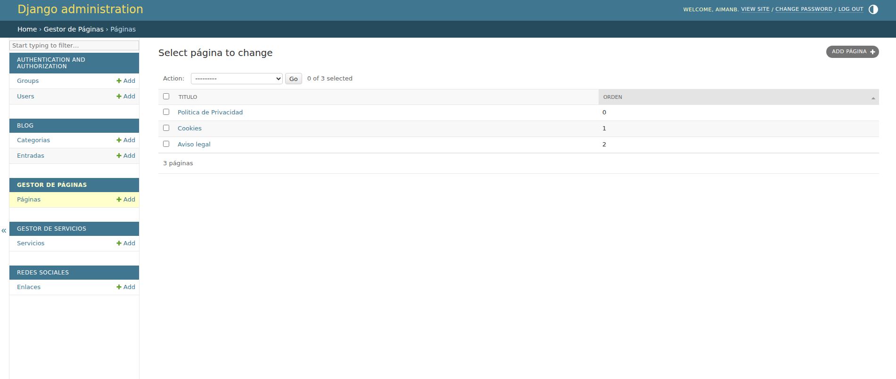
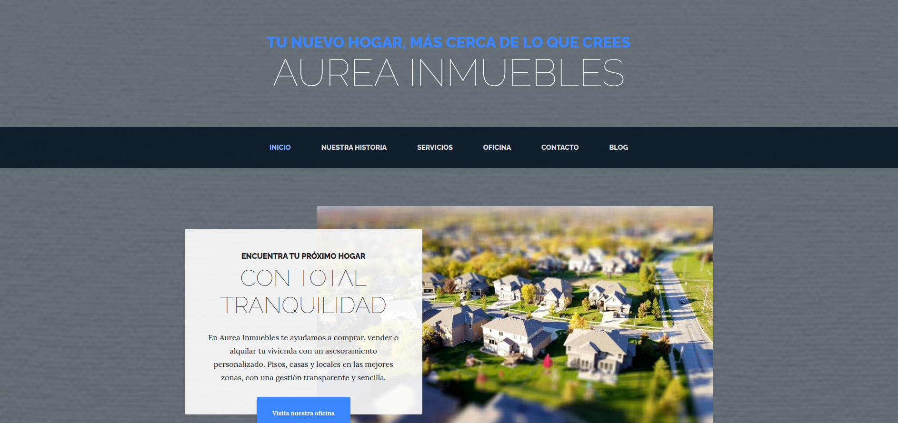
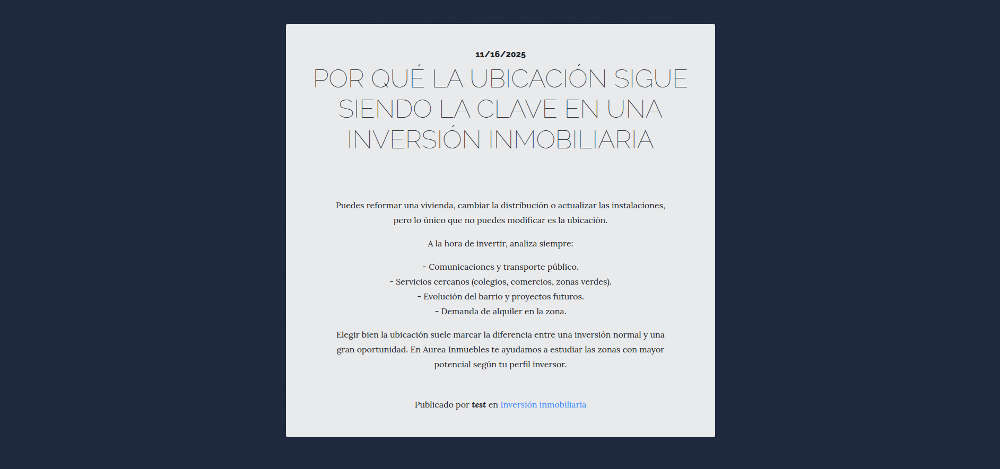
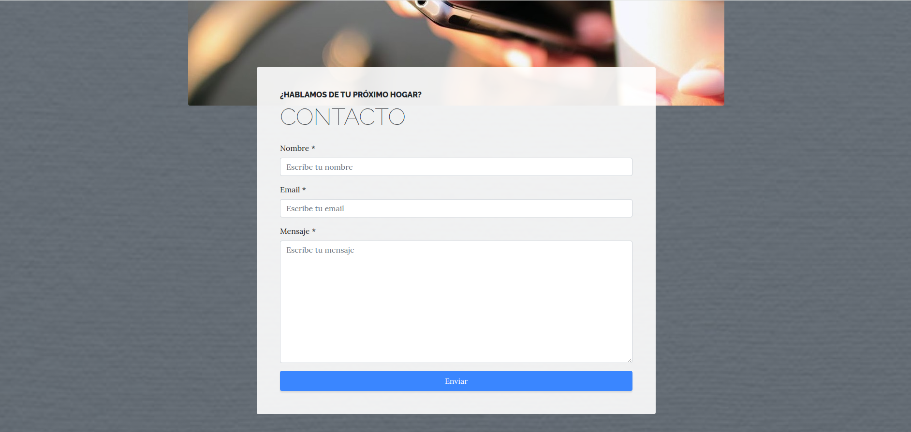

# Aurea Inmuebles – Plataforma Web Inmobiliaria

> Tu nuevo hogar, más cerca de lo que crees.

**Aurea Inmuebles** es una plataforma web inmobiliaria desarrollada con **Django** que simula la web corporativa de una agencia de bienes raíces.  
Permite gestionar servicios, propiedades, páginas de contenido, un blog corporativo y la comunicación con potenciales clientes a través de formularios, todo con un panel de administración completo y un diseño moderno y responsive.

---

##  Objetivo del proyecto

El objetivo del proyecto es construir una **web de negocio realista** para una inmobiliaria, que sirva como ejemplo de:

- Sitio corporativo profesional.
- Gestión dinámica de contenido desde el admin de Django.
- Organización de módulos típicos en una web de empresa: servicios, portfolio, blog, contacto, redes sociales…
- Despliegue en producción usando **Render**.

Es un proyecto ideal para mostrar en un portfolio como ejemplo de **aplicación Django orientada a negocio**.

---

##  Demo en producción

Sitio desplegado en Render:

- **Frontend:** `https://aurea-inmuebles.onrender.com`
- **Backend / Admin de Django:** `https://aurea-inmuebles.onrender.com/admin`  
  (requiere credenciales de superusuario configuradas en el entorno de producción)

---

##  Funcionalidades principales

### 1. Home y contenido corporativo
- Página principal con mensaje de marca, secciones destacadas y enlaces a servicios.
- Secciones editables desde el panel de administración.
- Textos y elementos visuales pensados para una **empresa inmobiliaria**.

### 2. Gestión de servicios y portfolio
- CRUD de **servicios** (por ejemplo: venta, alquiler, asesoría, tasación).
- Posibilidad de mostrar un **portfolio** de proyectos o propiedades destacadas.
- Todo el contenido se gestiona desde el admin, sin tocar código.

### 3. Blog corporativo
- Sistema de **blog** integrado:
  - Listado de artículos.
  - Detalle de cada entrada.
  - Posible filtrado por fecha/categoría (según configuración).
- Pensado para publicar noticias del sector, novedades de la empresa, consejos inmobiliarios, etc.

### 4. Formulario de contacto
- Página de contacto con formulario para que los usuarios:
  - Soliciten información.
  - Pidan cita.
  - Dejen sus datos de forma estructurada.
- El formulario se puede conectar a email o guardarse en base de datos (dependiendo de la configuración añadida).

### 5. Sistema multimedia
- Gestión de imágenes para:
  - Banners.
  - Servicios.
  - Entradas de blog.
  - Elementos visuales de la web.
- Uso de los campos de archivos de Django para organizar y reutilizar recursos.

### 6. Diseño responsive
- Plantillas basadas en **HTML5 + CSS + Bootstrap**.
- La web se adapta a **móvil, tablet y escritorio**, ofreciendo una experiencia de usuario consistente.

### 7. Panel de administración Django
- Admin de Django personalizado para gestionar:
  - Servicios.
  - Entradas de blog.
  - Páginas estáticas o semidinámicas.
  - Enlaces a redes sociales.
- Ideal para que un usuario no técnico pueda mantener la web actualizada.

### 8. Despliegue en Render
- Proyecto preparado para desplegar en **Render**:
  - Uso de `requirements.txt`.
  - Comando de inicio con **Gunicorn**.
  - Configuración de variables de entorno (`DEBUG`, `SECRET_KEY`, `ALLOWED_HOSTS`).
- Incluye lógica para crear un **superusuario automáticamente** en producción (según configuración).

---

##  Arquitectura y estructura del proyecto

El proyecto vive dentro del directorio `webempresa/` y se organiza en varias aplicaciones Django, separando responsabilidades:

```text
webempresa/
│
├── blog/          # Gestión de artículos y contenido del blog
├── contact/       # Formulario y lógica de contacto
├── core/          # Páginas base, layout general, lógica común
├── pages/         # Páginas informativas (quiénes somos, etc.)
├── services/      # Servicios inmobiliarios ofrecidos
├── social/        # Enlaces y configuración de redes sociales
│
├── webempresa/    # Configuración principal del proyecto
│   ├── settings.py
│   ├── urls.py
│   ├── wsgi.py
│
├── manage.py
├── requirements.txt
└── README.md
Cada app agrupa modelos, vistas, urls y templates, siguiendo las buenas prácticas de Django y facilitando la escalabilidad del proyecto.

```

🛠️ Tecnologías utilizadas
Área	Herramientas
Backend	Django, Python
Frontend	HTML5, CSS3, Bootstrap
Base de datos (dev)	SQLite
Deploy	Render (Python + Gunicorn)
Control de versiones	Git + GitHub

💻 Instalación y ejecución en local
1. Clonar el repositorio
bash
Copiar código
git clone https://github.com/aimanjr77tech/business-website.git
cd business-website/webempresa
(ajusta la ruta si tienes otra estructura en local)

2. Crear y activar entorno virtual
bash
Copiar código
python -m venv venv
source venv/bin/activate       # Linux/macOS
venv\Scripts\activate          # Windows
3. Instalar dependencias
bash
Copiar código
pip install -r requirements.txt
4. Aplicar migraciones
bash
Copiar código
python manage.py migrate
5. Crear superusuario (solo entorno local)
bash
Copiar código
python manage.py createsuperuser
6. Ejecutar el servidor de desarrollo
bash
Copiar código
python manage.py runserver
Después, accede a:

Frontend: http://127.0.0.1:8000/

Admin: http://127.0.0.1:8000/admin/

 Variables de entorno para producción
En un entorno como Render se esperan, al menos, estas variables:

ini
Copiar código
DEBUG=False
SECRET_KEY=tu_clave_secreta
ALLOWED_HOSTS=aurea-inmuebles.onrender.com
El proyecto también contempla la posibilidad de crear un usuario admin automáticamente en producción al desplegar.

## Capturas del Proyecto

A continuación se muestran algunas capturas del panel de administración de Django y de la interfaz pública del sitio web.  
Estas imágenes ayudan a visualizar el funcionamiento real de la plataforma.

---

###  Panel de Administración (Django Admin)

#### ▶ Dashboard principal del administrador


#### ▶ Gestión de servicios


#### ▶ Gestión de entradas del blog


#### ▶ Edición de páginas informativas


---

### 🌐 Interfaz Pública del Sitio Web

#### ▶ Página de Inicio


#### ▶ Página de Servicios


#### ▶ Blog corporativo


#### ▶ Página de contacto


---

> 📌 *Nota:* estas imágenes se encuentran en la carpeta `/screenshots` dentro del repositorio.  
Puedes actualizar las capturas cuando añadas nuevas funcionalidades o mejores visuales.


## Contacto
 Autor: Aiman Benslaiman
 Email: aimanecom77@gmail.com
 GitHub: https://github.com/aimanjr77tech
 Portfolio: 

